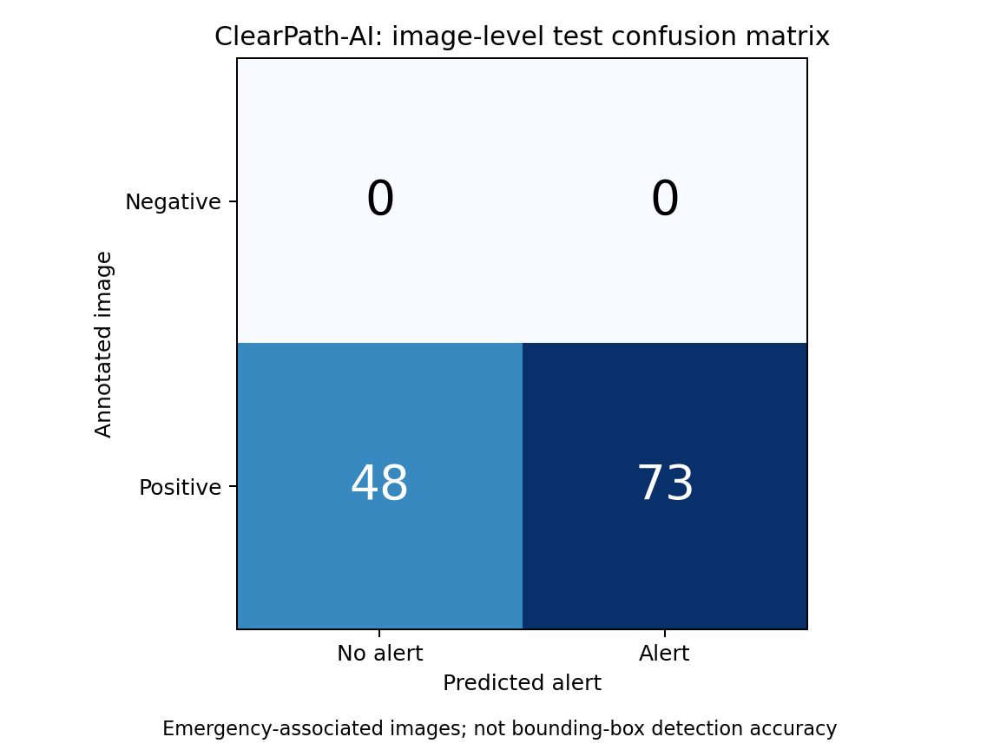

# ClearPath-AI

A computer-vision prototype exploring emergency-vehicle prioritization at traffic junctions using YOLOv8, OpenCV, and a rule-based signal simulation.

## Current implementation

The demo reads four prerecorded traffic videos, detects objects with a pretrained COCO YOLOv8n model, and prints a signal decision for each junction. It prioritizes an emergency alert, otherwise considers a fixed simulated traffic level. It displays the original video frames in OpenCV windows.

**This is a prototype:** signal decisions are console messages; traffic density is hardcoded; there is no physical signal integration, coordinated green corridor, or measured emergency-response-time improvement. The current detector flags class names containing `ambulance`, `police`, `fire`, or `truck`. Ordinary trucks and fire hydrants can therefore trigger alerts. The supplied checkpoint is not an ambulance-specific trained model.

```text
Four prerecorded videos
          ↓
YOLOv8n object detection
          ↓
Keyword-based emergency alert
          ↓
Simulated signal decision → Console output
```

## Measured baseline evaluation

The current alert rule was evaluated on **121 annotated test images** from the supplied ambulance dataset, using confidence **0.25**, inference size **640**, and CPU inference. This measures whether an emergency-associated image triggers an alert; it does not measure bounding-box localization or ambulance recognition accuracy.

| Image-level metric | Measured result |
|---|---:|
| Accuracy | 60.33% |
| Precision | 100.00%* |
| Recall | 60.33% |
| F1 score | 75.26% |
| True positives / false negatives | 73 / 48 |
| False positives / true negatives | 0 / 0 |
| Specificity / false-positive rate | Not estimable |
| Ambulance detection mAP | Not available for this checkpoint |

**\*All 121 test images are positive.** Precision is consequently trivial when any alert occurs, and accuracy equals recall. These scores do not establish real-world precision or deployment accuracy. Ground truth treats any annotated ambulance/siren object as an emergency-associated image; it does not establish an active emergency. The COCO checkpoint has no matching ambulance/siren class taxonomy, so incompatible class-ID detection scores were deliberately not reported.

The audit found **no exact-byte image duplicates across splits**. It does not rule out augmented copies or shared scenes. The supplied dataset contains 1,169 training, 229 validation, and 121 test images, with three distinct labels: `Ambulance`, `ambulance`, and `siren`.

- [Full measured report and presentation wording](evaluation_results/20261002T173351031941Z_test/REPORT.md)
- [Machine-readable metrics and environment](evaluation_results/20261002T173351031941Z_test/metrics.json)
- [Per-image predictions](evaluation_results/20261002T173351031941Z_test/per_image_results.csv)
- [Evaluation guide](EVALUATION.md)



## Setup and demo

Python 3.12 and Ultralytics 8.3.152 were used for the recorded evaluation.

```sh
python -m venv .venv
source .venv/bin/activate
python -m pip install -r requirements.txt
```

Model weights, dataset images, and traffic videos are **not included in this repository**. Obtain the pretrained YOLOv8n weights from Ultralytics and place them at `models/yolov8n.pt`. The dataset's Roboflow source and CC BY 4.0 attribution are recorded in [README.dataset.txt](README.dataset.txt) and [README.roboflow.txt](README.roboflow.txt). Export the dataset in YOLO format and arrange it as follows:

```text
ClearPath-AI/
├── main.py
├── controllers/
│   ├── detection.py
│   └── signal_controller.py
├── models/yolov8n.pt
├── emergency-dataset/
│   ├── data.yaml
│   ├── train/{images,labels}/
│   ├── valid/{images,labels}/
│   └── test/{images,labels}/
├── video_feed/
├── evaluate_model.py
└── evaluation_results/
```

For the video demo, provide these locally licensed video files in `video_feed/`, or edit the paths in `main.py` to use your own:

- `13028093_3840_2160_30fps.mp4`
- `13105476_3840_2160_30fps.mp4`
- `13527819_1080_1920_30fps.mp4`
- `gettyimages-1460800864-640_adpp.mp4`

Run from the project directory:

```sh
python main.py
```

Press **q** while an OpenCV video window has focus to exit. Processing also stops when any video ends or cannot be read.

## Reproduce the evaluation

With the local checkpoint and annotated dataset available:

```sh
python evaluate_model.py
```

Each run creates a timestamped results directory containing a report, JSON metrics, per-image CSV, hashed evaluation manifest, and confusion-matrix chart. Missing or malformed annotations cause an error rather than being silently treated as negatives. Published manifest paths are repository-relative; hashes preserve the identity of the evaluated files.

For a model genuinely trained on the dataset's exact class IDs and names:

```sh
python evaluate_model.py --model runs/detect/train/weights/best.pt --mode detector
```

Compatible weights enable native detection precision, recall, macro F1, mAP@0.50, mAP@0.50:0.95, per-class AP, and diagnostic plots. This branch is implemented but was not exercised in the recorded baseline because compatible trained weights were not present. Use `--split val` for development; freeze thresholds before evaluating the test set. See [EVALUATION.md](EVALUATION.md) for definitions and limitations.

## Next research steps

- Resolve the two ambulance label IDs and define the role of siren annotations.
- Train and evaluate an ambulance-specific detector.
- Build an independent test set with ordinary traffic, trucks, and fire hydrants as negative examples.
- Split by original scene/video before augmentation to reduce leakage.
- Measure detection mAP, per-class recall, false-alert rates, and latency under controlled conditions.
- Replace fixed traffic levels and console decisions with evaluated traffic estimation and signal simulation.

## References

- [Ultralytics model validation](https://docs.ultralytics.com/modes/val/)
- [Ultralytics performance metrics](https://docs.ultralytics.com/guides/yolo-performance-metrics/)
- [Roboflow dataset source](https://universe.roboflow.com/reds-qoztr/ambulance-detection-lqq9n-fykat)
